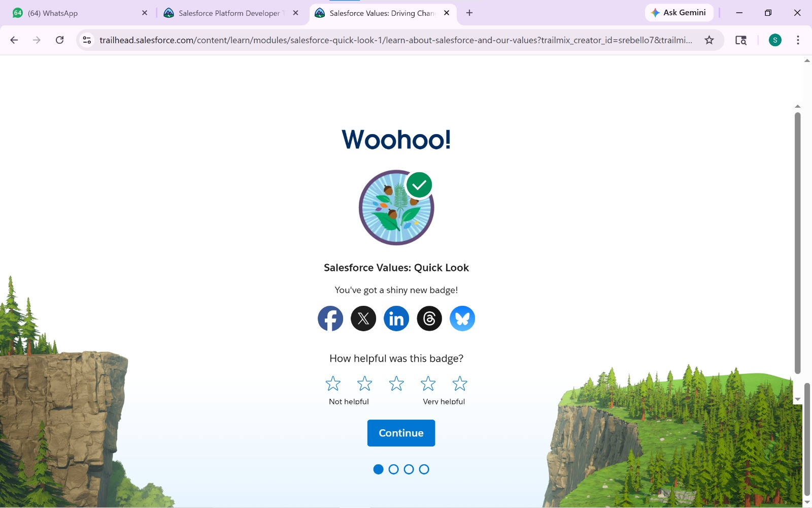
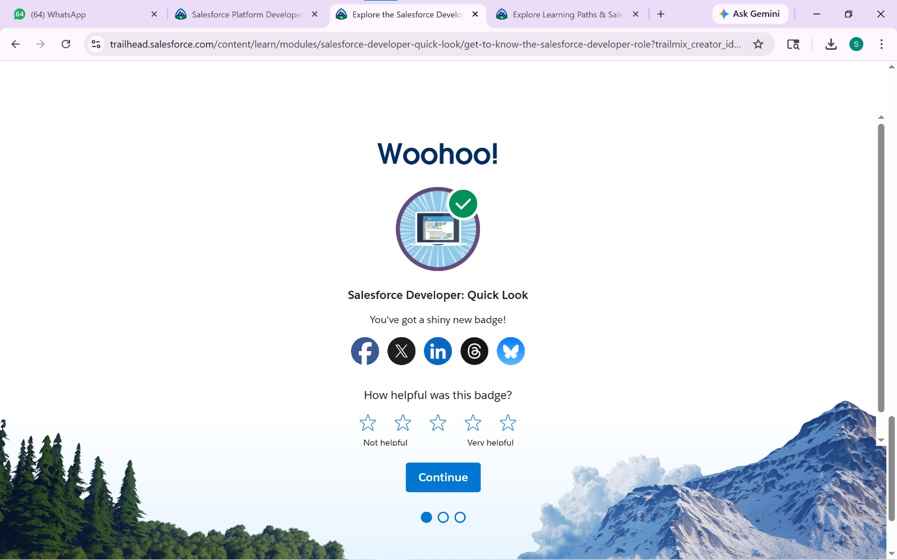
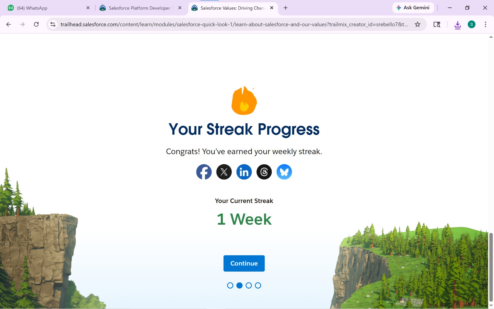
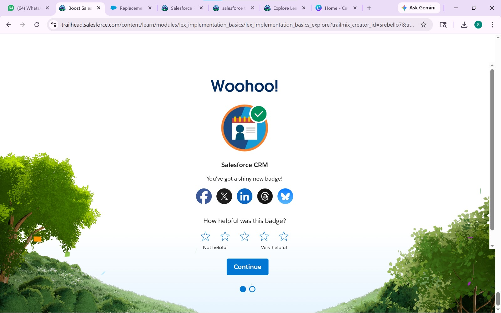
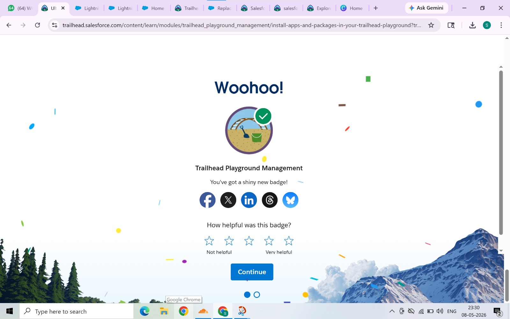

# Day 1 - Salesforce Basics

## Topics Covered
- CRM Basics
- Introduction to Salesforce
- Objects and Records
- Salesforce Admin vs Developer

## Tasks Completed
- Watched introductory videos
- Completed Trailhead modules
- Submitted mandatory questions
- Created GitHub repository structure
# Salesforce Summer Program - Day 1

## What is CRM

CRM stands for Customer Relationship Management.
It helps companies manage customer data, sales, and communication.

## Why Companies Use Salesforce

Companies use Salesforce to:
- Manage customers
- Track sales
- Improve communication
- Increase business growth

## Account

Account represents a company or organization.

## Contact

Contact represents a person related to the account.

## Opportunity

Opportunity represents a potential business deal or sale.

## Business Flow

Lead → Contact → Opportunity → Customer

A lead shows interest in the service.
After communication, the lead becomes a contact.
If the deal is possible, it becomes an opportunity.
When completed, the person becomes a customer.

## Real-World Mapping (College Admission)

- Account = College
- Contact = Student
- Lead = Student interested in admission
- Opportunity = Admission process
  ## Screenshots

